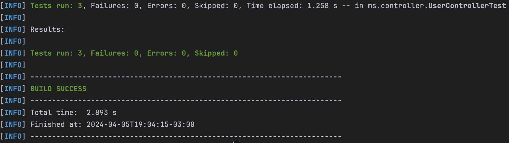

# Evaluación: JAVA

En este ejemplo, he utilizado H2 como base de datos en memoria y el resto de servicios web se exponen a través de Swagger-UI.
El proyecto se puede ejecutar de la siguiente manera:

 - mvn clean
 - mvn install
 - mvn spring-boot:run


- Pre Requisitos
```
 Puedes usar la siguiente shell script para generar una clave secreta de 32 bytes de longitud 
 y codificarla en Base64, keysecretgen.sh . Para ejecutar este script, guárdalo en un archivo, 
 por ejemplo, keysecretgen.sh, dale permisos de ejecución con :
 
 chmod +x keysecretgen.sh, 
 
 y luego ejecútalo con 
 
 ./keysecretgen.sh.

- Dependencias io.jsonwebtoken 0.12.3  
```

Una vez que el proyecto esté en funcionamiento, se puede acceder a DB, Services y Swagger-UI de la siguiente manera:

 - DB
	 - acceder a localhost:8080/desafioh2/h2-console con schema jdbc:h2:mem:testdb  conectarse y ver datos de tablas.
 
 - Services

	 - User
		 - GET  localhost:8080/desafioh2/user
	 	 - GET  localhost:8080/desafioh2/user/{id}
		 - POST localhost:8080/desafioh2/user
		 - PUT  localhost:8080/desafioh2/user
		 - DELETE localhost:8080/desafioh2/user/{id}	

	 - Phones
		 - GET  localhost:8080/desafioh2/phones
		 - GET  localhost:8080/desafioh2/phones/{id}
         - POST localhost:8080/desafioh2/phones
		 - PUT  localhost:8080/desafioh2/phones/{id}
		 - DELETE localhost:8080/desafioh2/phones/{id} 
		 
 - Swagger-UI
	 - localhost:8080/desafioh2/swagger-ui/index.html

- Spring Boot Application

- Seguridad

Esta aplicación está protegida con Spring Security utilizando autenticación básica. El acceso a los endpoints protegidos requiere credenciales de usuario válidas.

- Autenticación Básica

Para acceder a los endpoints mediante herramientas como Postman:

1. Configura el método HTTP y la URL del endpoint.
2. Ve a la pestaña `Authorization`, selecciona `Basic Auth` e introduce el nombre de usuario "admin" y  la contraseña "admin".
3. Postman añadirá automáticamente el encabezado `Authorization` a tu solicitud.
4. Envía la solicitud.

- Credenciales de acceso predeterminadas

Se están utilizando las configuraciones de seguridad predeterminadas de Spring Boot, lo cual significa que se proporciona 
una contraseña autogenerada para el usuario por defecto. Para iniciar sesión, utiliza las siguientes credenciales:
- **Username:** `user`
- **Password:** Revisa el log de la aplicación en la consola en busca de una línea similar a:
```
  Using generated security password: a4fd55fa-2d66-4818-b158-a00c01b50c73
```

- Test Junit
- 
  

- Ejecuta el siguiente comando para generar el sitio y los reportes:

```
mvn site
```